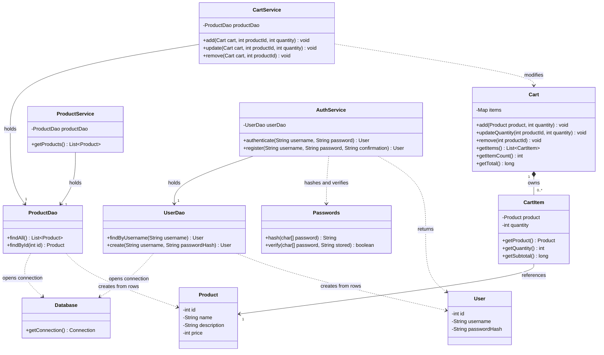

# Webshop class diagram

This diagram describes the Java classes developed for the grade-3 webshop. It is based on the implementation discussed during development check class names and signatures against the submitted source. Constructors, most getters, private helpers, and the password-hash command-line utility are omitted for readability.

## Java classes

The `items` field is a `Map<Integer, CartItem>`, abbreviated to `Map` for Mermaid compatibility. `Database.getConnection()`, `Passwords.hash()`, and `Passwords.verify()` are static methods. Public no-argument constructors on `Cart` and the service classes allow their use with `jsp:useBean`.

## Relationship notation

| Notation | Meaning | Example |
| --- | --- | --- |
| `+` | Public member | `Cart.getTotal()` |
| `-` | Private field | `Product.price` |
| Solid arrow | Navigable association: an object holds a reference | `CartItem` holds a `Product` |
| Dashed arrow | Dependency: a class uses another class | `AuthService` calls `Passwords` |
| Filled diamond | Composition: a whole owns its parts | A `Cart` owns its `CartItem` entries |
| `1` | Exactly one | Each cart item references one product |
| `0..*` | Zero or more | A cart may be empty or contain multiple entries |

The same product ID appears at most once in a cart's map. Adding it again increases the existing quantity. A product can exist independently of any cart, so the relationship from `CartItem` to `Product` is an association rather than composition.

The cart stores `CartItem` objects with fixed product/quantity fields. Updating a quantity replaces the entry. Cart operations are synchronized to protect access to the same cart object from concurrent requests.

## Relationship to the three layers

JSP files are presentation resources, not Java source classes written for this application, so they are described separately rather than represented as invented controller classes.

| Layer | Components | Responsibility |
| --- | --- | --- |
| Presentation | `products.jsp`, `cart-action.jsp`, `cart.jsp`, `login.jsp`, `checkout-account.jsp`, `logout.jsp`, JSP fragments, CSS and JavaScript | HTTP input/output, page rendering, redirects, and session management |
| Business/domain | `ProductService`, `CartService`, `AuthService`, `Cart`, `CartItem`, `Product`, `User`, `Passwords` | Coordinate operations, validate business rules, authenticate users, and represent domain data |
| Data access | `ProductDao`, `UserDao`, `Database` | Execute SQL through JDBC and map database rows to Java objects |

Models are used across layer boundaries they do not constitute a separate fourth layer. `Passwords` is a standard-Java utility used by authentication logic. There is no `ProductServlet` or custom controller class in the current implementation.

### Presentation entry points

| Resource | Collaborators / behavior |
| --- | --- |
| `products.jsp` | Calls `ProductService` to retrieve products renders cards and shared dialogs |
| `cart-action.jsp` | Validates the HTTP method/form token, calls `CartService`, and redirects |
| `cart.jsp` | Reads the session cart displays account forms or demo delivery/payment sections |
| `login.jsp` | Calls `AuthService.authenticate()` sets identification attributes after success |
| `checkout-account.jsp` | Calls `AuthService.authenticate()` or `register()` preserves the cart on success |
| `logout.jsp` | Validates the request and invalidates the session |
| `checkout.jsp` | Redirects to the checkout interface in `cart.jsp` |
| `cart-session.jspf` | Retrieves/creates the session-scoped `Cart` and form token |

## Request examples for the presentation

**List products:** `products.jsp` calls `ProductService.getProducts()`. The service calls `ProductDao.findAll()`. The DAO opens a JDBC connection through `Database`, executes its query, and creates `Product` objects. The JSP displays the returned list.

**Add a product:** `cart-action.jsp` reads the product ID and quantity and calls `CartService.add()`. The service uses `ProductDao.findById()` to retrieve the server-side product and price, then calls `Cart.add()`. The cart validates quantities and updates its entries. The JSP redirects the browser after the operation.

**Log in:** A JSP passes credentials to `AuthService.authenticate()`. The service retrieves a `User` through `UserDao` and verifies the password through `Passwords`. On success, the JSP changes the session ID and stores the user ID and username. The existing cart is retained the password hash is not stored in the session.

**Register:** `checkout-account.jsp` calls `AuthService.register()`. The service validates the input and hashes the password, then calls `UserDao.create()`. The DAO inserts the account and returns its generated ID with the user data. The JSP establishes the authenticated session.

## State and scope

- `Cart` is session-scoped separate browser sessions have separate carts.
- Service beans instantiated with `scope="page"` are created for that page request, not shared across every user.
- Services hold DAO references DAOs open and close connections per operation instead of retaining a shared connection field.
- Users and products are stored in PostgreSQL. Cart items are held in the HTTP session and are not persisted in the database.
- Prices use integer SEK values. Subtotals and totals use `long`.
- Delivery and payment sections are a demo. There are no order, stock, payment-processing, or role-management classes.
